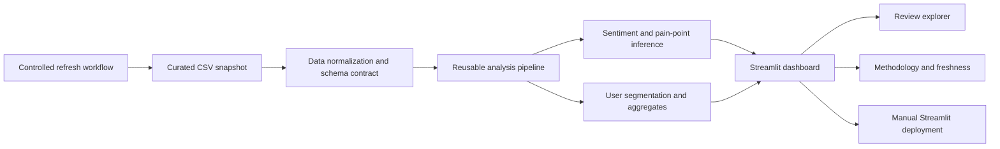

# LMS Review Intelligence

Interactive product analytics for customer reviews, built as a production-oriented Streamlit application with a reusable Python analysis layer.

## Product overview

LMS Review Intelligence turns a curated review dataset into an analyst-friendly workspace for understanding customer sentiment, ratings, pain points, user segments, and review-level evidence.

The product is designed for product managers, analysts, and growth teams who need to move from **"What is happening?"** to **"Which reviews and issues explain it?"** without opening a notebook.

### Problem statement

Review datasets contain useful customer signals, but raw reviews are difficult to analyze consistently at scale. This project provides a repeatable analytical pipeline and interactive dashboard that standardize review cleaning, sentiment inference, pain-point tagging, heuristic segmentation, filtering, and review exploration.

The application is intentionally transparent about what is measured versus inferred. Sentiment, pain points, and customer segments are analytical signals rather than ground-truth business outcomes.

## Live demo

**Production status:** Phase 11 deployment preparation is complete. The public Streamlit Community Cloud deployment is a separate manual step.

**Live application:** Pending manual Streamlit Community Cloud deployment.

Once the deployment is created, replace the status above with the public application URL. No application code change is required to create the deployment.

## What the application provides

- Executive KPIs for review volume, average rating, negative sentiment, and the churn heuristic.
- Interactive filters for rating, sentiment, user segment, pain point, review text, and review date.
- Rating, sentiment, segment, and pain-point distributions.
- Pain points by rating and sentiment-versus-rating analysis.
- Pain-point co-occurrence analysis.
- Review-volume trend analysis when source timestamps are available.
- Paginated review exploration with search, sorting, filtering, and individual review inspection.
- Methodology, analytical-quality, coverage, and freshness information inside the application.
- A controlled refresh workflow that is separate from normal dashboard startup.

## Architecture



The production application starts from `app/main.py`, reads the committed dataset, and imports reusable logic from `src/`. The notebook under `notebooks/` is a reference workflow rather than a runtime dependency.

## Technology stack

| Area | Technology |
| --- | --- |
| Application | Streamlit |
| Language | Python 3.11.x |
| Data processing | pandas |
| Sentiment | TextBlob |
| Visualization | Streamlit charts and dataframes |
| Testing | pytest |
| Reference analysis | Jupyter Notebook |
| Data storage | CSV + JSON metadata |
| Deployment target | Streamlit Community Cloud |

## Project structure

```text
LMS-Data-Analysis/
├── app/
│   ├── main.py
│   └── review_explorer.py
├── src/
│   ├── data/
│   │   ├── manifest.py
│   │   ├── schema.py
│   │   └── reviews.py
│   ├── analysis/
│   │   ├── config.py
│   │   ├── sentiment.py
│   │   └── pain_points.py
│   ├── pipeline.py
│   ├── models/
│   └── utils/
├── data/
│   ├── lms_reviews_segmented.csv
│   └── dataset_metadata.json
├── tests/
├── notebooks/
│   └── LMS_reviews_analysis.ipynb
├── requirements.txt
├── requirements-dev.txt
├── .python-version
├── .streamlit/
│   └── config.toml
├── README.md
└── .gitignore
```

## Data and provenance

The repository contains a committed curated CSV snapshot at `data/lms_reviews_segmented.csv`. The source review content is preserved as the project's current analysis snapshot and is not rewritten by the application.

The dataset metadata in `data/dataset_metadata.json` records the state of the controlled refresh workflow. When no successful refresh has replaced the committed snapshot, the application treats the committed dataset as the last known-good snapshot.

The project does not claim ownership of third-party source reviews. Any redistribution or public deployment of the dataset must comply with the terms and policies applicable to the original source and collection library. Dataset provenance should therefore be evaluated separately from the software code when publishing or redistributing the project.

The normal application path does **not** scrape Google Play or another live source during page loads. Refreshing data is an explicit, controlled workflow so a failed refresh cannot silently replace the known-good dataset.

## Data contract

`src/data/schema.py` is the single source of truth for the review data contract.

### Source fields

- `reviewId` — required stable review identifier
- `userName` — optional source field
- `content` — required review text
- `score` — required 1–5 rating
- `thumbsUpCount` — optional helpful-vote count
- `at` — required review timestamp
- `appVersion` — optional app version

### Derived fields

The analytical pipeline adds `review_length`, `sentiment_score`, `sentiment_label`, six pain-point flags, `user_segment`, and `is_complaint`.

Source and derived columns remain separate so downstream consumers have an explicit contract. Optional source fields receive safe defaults. Unrecoverable records are excluded rather than crashing the application, and duplicate `reviewId` values are resolved deterministically using the latest timestamp and stable identifier ordering.

## Analytical methodology

### Sentiment

Sentiment uses TextBlob polarity. The default labels are:

- positive: score `> 0.1`
- neutral: score from `-0.1` through `0.1`
- negative: score `< -0.1`

Thresholds are configurable in the dashboard. TextBlob is not a Hindi/Hinglish-aware model and can misclassify mixed-language text, emojis, sarcasm, short reviews, and product-specific language. Sentiment is therefore an inferred signal, not ground truth.

### Pain points

Pain points are inferred through case-insensitive keyword matching for six categories:

- delivery
- cancellation
- refund
- customer support
- pricing
- food quality

A keyword match is a signal that a topic is present in the review; it is not proof that the underlying business issue occurred.

### User segmentation

The default heuristic rules are:

- `churned`: 1-star review with at least 2 matched pain points
- `at_risk`: rating ≤ 3 with at least 1 matched pain point
- `satisfied`: rating ≥ 4
- `passive`: remaining reviews

`churned` is explicitly a heuristic segment derived from review signals. It is **not verified customer churn**.

### Measured vs inferred data

Measured/source fields include review text, rating, helpful-vote count, review timestamp, and app version when supplied by the dataset. Inferred fields include sentiment, pain points, user segments, complaint flags, and aggregates based on those fields.

## Data freshness and refresh policy

The application reports:

- dataset row count
- review coverage period
- latest source review timestamp
- refresh retrieval metadata when available
- dashboard analysis generation time

Refreshing the dataset is intentionally separate from dashboard startup. A successful refresh validates the source data and reruns analysis before the active dataset is replaced. This preserves the last known-good snapshot when a refresh fails.

## Reproducible local setup

The supported runtime is **Python 3.11.x**, pinned through `.python-version`.

Create a virtual environment:

```bash
python --version
python -m venv .venv
```

Activate it:

```bash
# Windows PowerShell
.venv\\Scripts\\Activate.ps1

# Windows Command Prompt
.venv\\Scripts\\activate.bat

# macOS/Linux
source .venv/bin/activate
```

Install production dependencies:

```bash
python -m pip install --upgrade pip
python -m pip install -r requirements.txt
```

Start the application:

```bash
streamlit run app/main.py
```

For tests and notebook/reference work:

```bash
python -m pip install -r requirements-dev.txt
pytest
jupyter notebook notebooks/LMS_reviews_analysis.ipynb
```

The application does not require notebook execution, Colab state, or a live data source to start.

## Deployment

The production target is **Streamlit Community Cloud**. Deployment is intentionally manual; no GitHub Actions workflow is required.

Current deployment configuration:

- Repository: `stillbrainstorming/LMS-Data-Analysis`
- Branch: `main`
- Main file: `app/main.py`
- Python: `3.11.x`
- Dependencies: `requirements.txt`
- Dataset: `data/lms_reviews_segmented.csv`
- Secrets: none required for normal dashboard startup

### Manual deployment

1. Sign in to Streamlit Community Cloud with repository access.
2. Create an app from `stillbrainstorming/LMS-Data-Analysis`.
3. Select the `main` branch.
4. Set the main file to `app/main.py`.
5. Deploy the application.
6. Verify startup and dataset loading.
7. Verify filters, KPIs, charts, review exploration, methodology, and freshness information.
8. Record the public application URL in this README.

Deployment automation is deliberately out of scope. Do not add GitHub Actions for this project.

## Portfolio presentation

### Screenshots and demo assets

Production screenshots or a short GIF should be added here after the public deployment is available. This repository does not include fabricated screenshots or generated assets that do not represent the real application.

Recommended portfolio captures:

1. Executive snapshot showing KPIs and core review mix.
2. Drivers and relationships showing pain points by rating and sentiment versus rating.
3. Review explorer showing filters and review-level evidence.
4. Methodology and freshness section showing analytical transparency.

### Portfolio talking points

- Built a reusable Python analytical layer instead of keeping business logic inside a notebook.
- Converted exploratory review analysis into an interactive Streamlit product.
- Added explicit analytical configuration and transparent heuristic limitations.
- Added deterministic schema normalization, ingestion validation, regression coverage, and runtime reliability safeguards.
- Designed the application around a last-known-good dataset model so refresh failures do not silently break the product.
- Kept deployment lightweight and manual while separating production runtime requirements from reference notebook tooling.

## Quality and reliability

The repository includes deterministic tests covering analytical behavior, schema/data-quality rules, ingestion validation, and representative application-path behavior.

The Streamlit application caches stable data transformations, bounds review rendering, handles empty filtered results safely, and surfaces dataset/analysis failures without requiring notebook state.

## Current status

| Phase | Status |
| --- | --- |
| 1. Reusable analysis layer | Complete |
| 2. Product dashboard | Complete |
| 3. Review explorer | Complete |
| 4. Analytical quality and methodology | Complete |
| 5. Data pipeline and refreshability | Complete |
| 6. Data storage and application architecture | Complete |
| 7. Performance and reliability | Complete |
| 8. Visualizations and UX | Complete |
| 9. Testing and data validation | Complete |
| 10. Reproducibility and environment management | Complete |
| 11. Production deployment | Deployment preparation complete; public hosting remains manual |
| 12. Documentation and portfolio presentation | Complete |

## Security and repository hygiene

- No credentials or API keys are required for normal dashboard startup.
- Do not commit secrets, private data, or deployment credentials.
- Do not commit temporary notebook outputs or local virtual environments.
- The notebook is retained as a reference artifact and is not a production runtime dependency.

## License and source-data notice

The software documentation describes the project's implementation and analytical methodology. Source-data licensing, terms of use, and redistribution rights are separate considerations and should be verified against the original data source before publishing the dataset or a public derivative.

Where a deployment or portfolio host has different data-redistribution requirements, verify those requirements before making the curated CSV publicly accessible.
